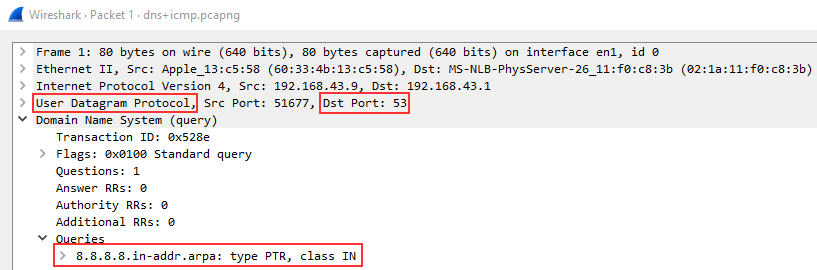

# Wireshark 101

## Task 01 - Introduction
* Wireshark 身為一個用於創建和分析 PCAPs（網絡封包擷取文件）的工具，通常被視為最好的封包分析工具之一。

## Task 02 - Installation
* Wireshark Offical Website: https://www.wireshark.org/

## Task 03 - Wireshark Overview
* Wireshark 的 Main page 主要允許我們指定
  * 傳入流量的接口 (Interface)
  * 過濾擷取的封包 (Filter)
* [Capture Filters (擷取過濾器)](https://wiki.wireshark.org/CaptureFilters)，會從根本上過濾掉不需要的封包，以節省資源。但相比 [Display Filters (顯示過濾器)](https://wiki.wireshark.org/DisplayFilters)只是調整顯示的封包，沒有被擷取的封包就不會被記錄了，如果需要會需要重新擷取。
* 一般來說 Wireshark 會提供一些封包的基本重要訊息，包含
  * 封包編號 (No.)
  * 時間戳記 (Time)
  * 來源 IP 位址 (Source)
  * 目的 IP 位址 (Destination)
  * 協定 (Protocol)
  * 長度 (Length)
  * 詳細資訊 (Info)
* Wireshark 還預設會對封包的危險性進行分級，並且用不同的顏色表示，能幫助我們更好地發現異常行為。
  > 

## Task 04 - Collection Methods
* 常見的封包擷取方法會有
  * 竊聽 (Taps)
  * 端口鏡像 (Port Mirroring)
  * MAC 泛洪 (MAC Flooding)
  * ARP 毒化 (ARP Poisoning)
* 竊聽比較屬於物理上的方法，可以有特殊的硬體設備介於網路設備中間，直接轉發複製流量。
* MAC Flooding 則是攻擊 Switch 中的 MAC Table，利用填滿 MAC Table 之後 Switch 會開始轉發所有流量的特性，讓攻擊者可以監聽所有流量。
* ARP Poisoning 則是利用 ARP 協定的特性，讓攻擊者可以偽造 ARP 訊息，讓對方誤以為自己是對方的路由器，導致對方的流量都會被攻擊者監聽。

## Task 05 - Filtering Captures
* Wireshark 的過濾器可以分為兩種
  * Capture Filters (擷取過濾器)
  * Display Filters (顯示過濾器)
* Capture Filters 會定義為擷取封包前的設定，Display Filters 則是在擷取完封包後封包分析工具。

### Filtering Operators (過濾器運算子)
* Wireshark 在過濾封包時，會需要利用 Filtering Operators 來過濾封包。
  * and opertaor - `and` / `&&`
  * or operator - `or` / `||`
  * equal operator - `eq` / `==`
  * not equal operator - `ne` / `!=`
  * greater than operator - `gt` / `>`
  * less than operator - `lt` / `<`
* 基本過濾方法可以看 [Wireshark: Traffic Analysis](./Wireshark-Traffic-Analysis.md) 的 Writeup，裡面有很多練習。

## Task 06 - Packet Dissection

## Task 07 - ARP Traffic
* ARP (Address Resolution Protocol) 是一種用於將 IP 位址轉換為 MAC 位址的協定，通常會在網路設備之間進行交換。
* ARP 主要會包含一組 REQUEST messages 跟 RESPONSE messages. 通常會是
  * REQUEST messages - 用於尋找目標 IP 位址的 MAC 位址
  * RESPONSE messages - 用於回應 REQUEST messages 的 MAC 位址
    > 
* 有一個在 Wireshark 中的小技巧，就是 Wireshark 一般來說會識別訊號來源的 Device 資訊，例如上圖的 `Intel_78`，有一個識別惡意流量的技巧就是一個未識別 Device 大量發送 REQUEST messages，就有可能是惡意流量。
  * 關於設定 physical address 的方法是 `View` -> `Name Resolution` -> `Ensure that Resolve Physical Addresses `，這樣就可以在封包中看到設備的名稱。

### Answer of the Question
* What is the OPcode for Packet 6?
  * `Request(1)`
  > Display Filter: `arp` -> Packet 6 -> `Opcode: Request (1)`
  > 
* What is the source MAC Address of Packet 19?
  * `80:fb:06:f0:45:d7`
  > Packet 19 -> `Sender MAC address: HuaweiTe_f0:45:d7 (80:fb:06:f0:45:d7)`
  > 
* What 4 packets are Replay packets?
  * `76,400,459,520`
  > Display Filter: `arp.opcode == 2`
  > 
* What IP Address is at `80:fb:06:f0:45:d7`?
  * `10.251.23.1`
  > Display Filter: `arp.opcode == 2` -> Packet Info (10.251.23.1 is at 80:fb:06:f0:45:d7)
  > 

## Task 08 - ICMP Traffic
* ICMP (Internet Control Message Protocol) 是一種用於網路設備之間傳遞訊息的協定，主要用於分析網絡上的各種節點，例如 `ping`, `traceroute` 等等。

### Answer of the Question
* What is the type of packet 4?
  * `8`
  > Display Filter: `icmp` -> Packet 4 -> `Type: 8 (Echo (ping) request)`
  > 
* What is the type of packet 5?
  * `0`
  > Display Filter: `icmp` -> Packet 5 -> `Type: 0 (Echo (ping) reply)`
  > 
* What is the timestamp for packet 12, only including month day and year? note: Wireshark bases it's time off of your devices time zone, if your answer is wrong try one day more or less. 
  * `May 30, 2013`
  > Display Filter: `icmp` -> Packet 12 -> `Time: May 31, 2013 06:45:20.253336000 CST`
  > 
* What is the full data string for packet 18?
  * `08090a0b0c0d0e0f101112131415161718191a1b1c1d1e1f202122232425262728292a2b2c2d2e2f3031323334353637`
  > Display Filter: `icmp` -> Packet 18 -> `Data: 08090a0b0c0d0e0f101112131415161718191a1b1c1d1e1f202122232425262728292a2b2c2d2e2f3031323334353637 [Length: 48]`
  > 

## Task 09 - TCP Traffic
* TCP (Transmission Control Protocol) 是一種用於傳輸資料的協定，主要用於傳輸資料，例如 HTTP, HTTPS, FTP 等等。
* 在 TCP 的 Packet 中，我們會分別針對 SYN, SYN-ACK, ACK 三個封包在意的點做紀錄，
  * SYN 封包中，我們會確認 `Sequence Number`，這個數字會在後續的封包中被使用，例如 ACK 封包中的 `Acknowledgement Number`。
* 再觀察 TCP 的 Packet 過程會注意不要獨立觀看封包。
* 在 TCP 的交互過程中，如果產生 RST 封包，那麼就代表這個封包是錯誤的，例如請求的資料不存在，或是請求的資料已經被刪除。而 RST 封包會直接結束這個 TCP 連線。
  * RST 封包的產生會被視為不安全的行為是因為一般來說如果有連續大量的錯誤 TCP 封包，那麼就代表有惡意的攻擊者在進行如 `Nmap` 等等的掃描。

## Task 10 - DNS Traffic
* DNS (Domain Name System) 是一種用於將網域名稱轉換成 IP 位址的協定，主要用於解析網域名稱。
* 對於 DNS 的封包，我們會在意三個核心要素，`Query-Response`, `DNS-Servers Only`, `UDP`。
  * DNS 的封包一定是用 UDP 協議來傳輸的，因為 DNS 的封包是不需要確認是否有正確傳輸的，所以不需要 TCP 的確認機制。而其如果是 TCP，則代表可能是 DNS Tunneling 的攻擊等等惡意行為。
* 一般來說看到 DNS Query 封包會檢查其 protocol, Dst port, 跟其查詢的內容，例如 `User Datagram Protocol`, `Dst Port: 53`, `8.8.8.8.in-addr.arpa: type PTR, class IN` 等等。
  > 
* DNS Response 相比 Query 會多一個 Answers 的欄位，這個欄位會顯示 DNS Server 回傳的 IP 位址，例如 `8.8.8.8.in-addr.arpa: type PTR, class IN, google-public-dns-a.google.com` 等等。
  > 

### Answer of the Question
* What is being queried in packet 1?
  * `8.8.8.8.in-addr.arpa`
* What site is being queried in packet 26?
  * `www.wireshark.org`
* What is the Transaction ID for packet 26?
  * `0x2c58`

## Task 11 - HTTP Traffic

## Task 12 - HTTPS Traffic

## Task 13 - Analyzing Exploit PCAPs

## Task 14 - Conclusion

